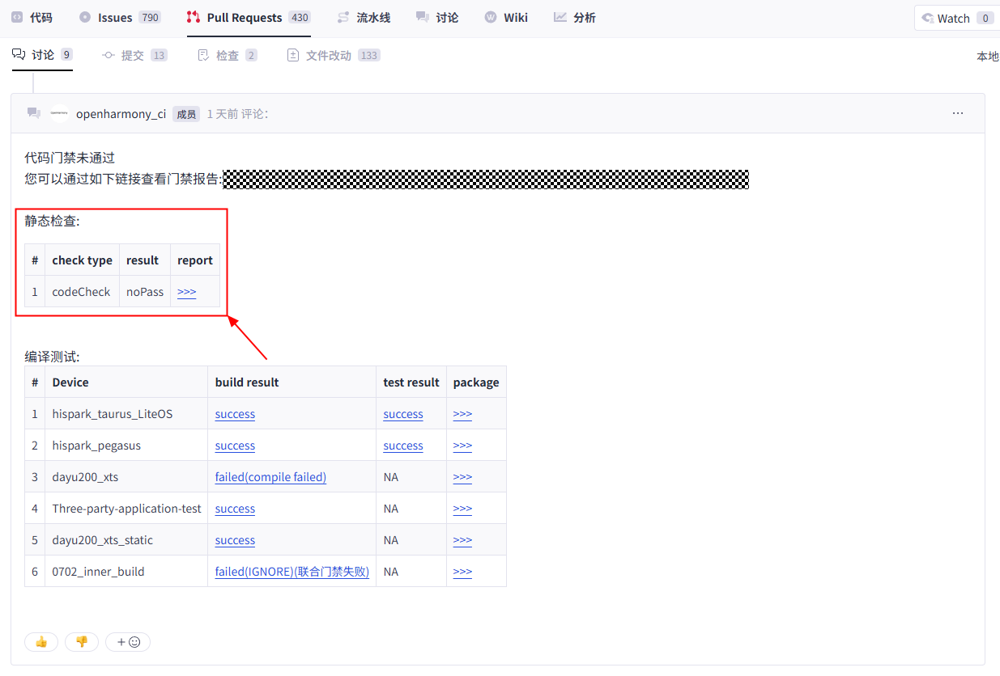
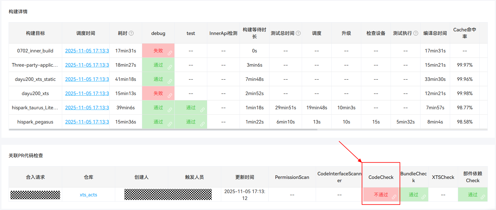
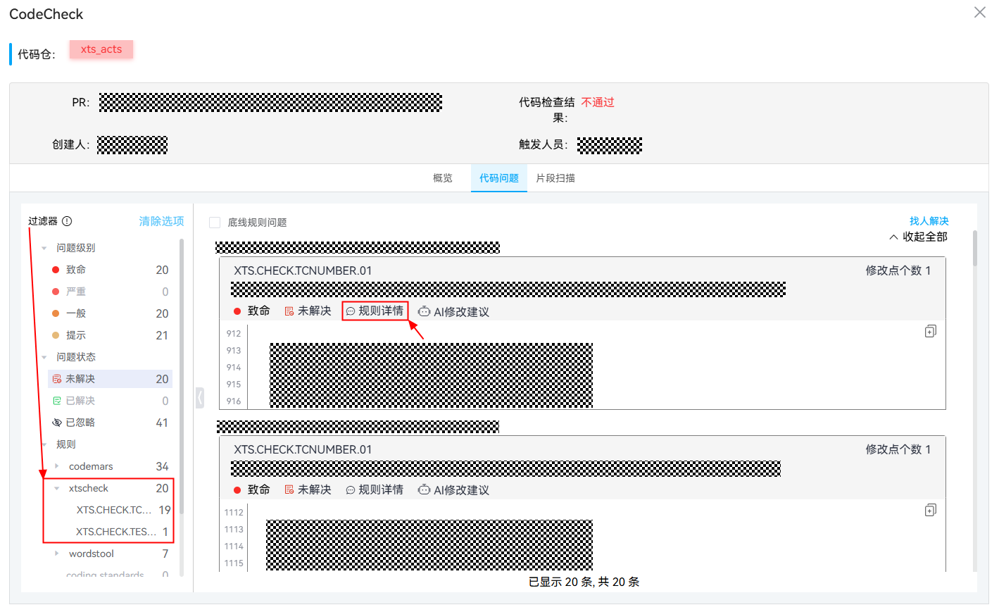
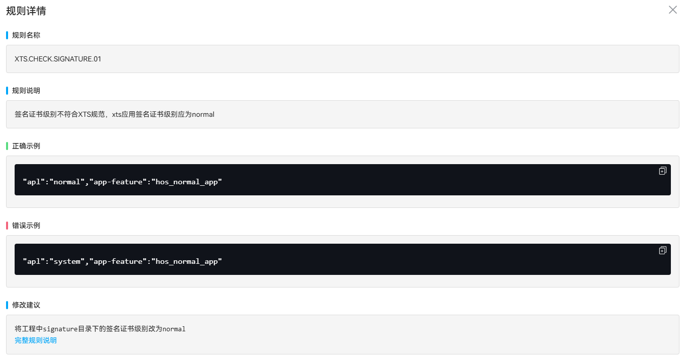

# XTS CodeCheck规则说明

## XTS CodeCheck在门禁中的位置





**并非所有CodeCheck问题都由XTS管控，XTS CodeCheck只关注“规则”列表下`xtscheck`一项**



**请先查看规则详情（入口见上图），有疑问再咨询XTS团队**



## 文档注释书写规范

文档注释，顾名思义就是在代码中以注释的形式写文档，使用文档工具可以根据代码生成文档，例如Java API Doc就是由JDK源码的文档注释生成。好的文档注释可以增强代码的可读性与可维护性，让代码开口为自己“说话”。

有别于一般的代码注释，书写文档注释要遵守一定的规范，否则无法保证生成文档的质量，XTS用例对C、CPP、JavaScript和ArkTs语言用例的文档注释做出以下要求：

- 文档注释以`/**`开头，以`*/`结尾，每行以`*`开始；
- 参数名以`@`修饰，参数名和参数值以（一或若干个）空格分隔，**禁止使用其它分隔符**；
- 文档注释结束行的**下一行**应紧接要修饰的测试用例，禁止出现空行。

测试用例声明注意点：

- 测试用例命名规则：test<测试点>[编号]，小驼峰形式；
- 测试用例使用字符串字面量，不要使用或拼接变量；
- 测试用例类型参数选填，默认值为MEDIUMTEST；
- 测试用例规模参数选题，默认值为FUNCTION；
- 测试用例级别参数必填；
- 更多细节请移步wiki。

文档注释书写注意点：

- @tc.name与测试用例名称一致，JavaScript/ArkTs用例名称为第一个参数值，C/CPP为第二个参数值；
- @tc.number为用例编号，命名规则`SUB_<子系统>_<部件>[_额外_描述]_<4位阿拉伯数字编号>`；
- @tc.desc为用例描述信息，用于简略描述用例测试内容、预期结果等；
- @tc.type、@tc.size、@tc.level的值在文档注释中请保持全大写；
- 文档注释变量值单行最佳。

### 正确示例

JavaScript/ArkTs

```JavaScript
/**
 * @tc.name   testAsyKeyGeneratorRSAFunc
 * @tc.number SUB_Security_CryptoFramework_AsyKeyGenerator_Func_0100
 * @tc.desc   Test Generator Asymmetric Key algName with RSA. Sync style.
 * @tc.type   FUNCTION
 * @tc.size   MEDIUMTEST
 * @tc.level  LEVEL3
 */
it("testAsyKeyGeneratorRSAFunc", TestType.FUNCTION | Size.MEDIUMTEST | Level.LEVEL3, async (done: Function) => {
    // test code.
});
```

C

```C
/**
 * @tc.name   testKvStoreSetValue
 * @tc.number SUB_UTILS_KV_STORE_0100
 * @tc.desc   UtilsSetValue parameter legal test.
 * @tc.type   FUNCTION
 * @tc.size   MEDIUMTEST
 * @tc.level  LEVEL1
 */
LITE_TEST_CASE(KvStoreFuncTestSuite, testKvStoreSetValue, Function | MediumTest | Level1)
{
    // test code.
};
```

CPP

```CPP
/**
 * @tc.name   testSecPMPMS0100
 * @tc.number SUB_SEC_AppSEC_PermissionMgmt_PMS_0100
 * @tc.desc   Calling PMS interface to install and save unauthorized application for the first time.
 * @tc.type   FUNCTION
 * @tc.size   MEDIUMTEST
 * @tc.level  LEVEL1
 */
HWTEST_F(ActsPMSSaveTestSuite, testSecPMPMS0100, Function | MediumTest | Level1) {
    // test code.
}
```

### 错误示例

在文档注释参数名和参数值之间插入任意分隔符（典型分隔符为`:`），将导致参数值解析错误，如：

> @tc.name: testName

将解析为（第一行为参数名称，下一行为参数值）：

- @tc.name:
- testName

显然，`tc.name:` != `tc.name`，XTS CodeCheck会因找不到文档注释`@tc.name`而失败

> @tc.name : testName

将解析为（第一行为参数名称，下一行为参数值）：

- @tc.name
- : testName

此时`: `将作为参数值的一部分，XTS CodeCheck会因文档注释`@tc.name`的值和测试用例名称不一致而失败

以下是错误示例，请**避免**这样的写法：

JavaScript/ArkTs

```JavaScript
/**
 * @tc.name:   testAsyKeyGeneratorRSAFunc
 * @tc.number: SUB_Security_CryptoFramework_AsyKeyGenerator_Func_0100
 * @tc.desc:   Test Generator Asymmetric Key algName with RSA. Sync style.
 * @tc.type:   FUNCTION
 * @tc.size:   MEDIUMTEST
 * @tc.level:  LEVEL3
 */
it("testAsyKeyGeneratorRSAFunc", TestType.FUNCTION | Size.MEDIUMTEST | Level.LEVEL3, async (done: Function) => {
    // 使用了分隔符':'
    // test code.
});
```

C

```C
/**
 * @tc.name   testKvStoreSetValue
 * @tc.number SUB_UTILS_KV_STORE_0100
 * @tc.desc   UtilsSetValue parameter legal test.
 * @tc.type   FUNCTION
 * @tc.size   MEDIUMTEST
 * @tc.level  LEVEL1
 */

LITE_TEST_CASE(KvStoreFuncTestSuite, testKvStoreSetValue, Function | MediumTest | Level1)
{
    // 文档注释下一行应紧接要修饰的测试用例，不允许存在空行。
    // test code.
};
```

CPP

```CPP
/*
 * @tc.name   testSecPMPMS0100
 * @tc.number SUB_SEC_AppSEC_PermissionMgmt_PMS_0100
 * @tc.desc   Calling PMS interface to install and save unauthorized application for the first time.
 * @tc.type   FUNCTION
 * @tc.size   MEDIUMTEST
 * @tc.level  LEVEL1
 */
HWTEST_F(ActsPMSSaveTestSuite, testSecPMPMS0100, Function | MediumTest | Level1) {
    // 文档注释以/**开头，/*开头的多行注释不是文档注释。
    // test code.
}
```

## 问题级别说明
| 问题级别 | 说明 |
| --- | --- |
| <span style="padding: 3px;border-radius: 5px;background-color: red;color: white;">**致命**</span> | 除非错检，否则无法屏蔽问题上库，需领域整改至问题不再检出 |
| <span style="padding: 3px;border-radius: 5px;background-color: #f95f5b;color: white;">**严重**</span> | 需要整改，如有疑问可联系XTS团队澄清 |
| <span style="padding: 3px;border-radius: 5px;background-color: #fe9900;color: white;">**一般**</span> |  |
| <span style="padding: 3px;border-radius: 5px;background-color: #ffeca1;color: #7d7b92;">**提示**</span> |  |

## 现行规则

### 0. Hvigor工程结构检查

#### 问题代码

`XTS.CHECK.HVIGOR.01`

#### 问题级别

<span style="padding: 3px;border-radius: 5px;background-color: red;color: white;">**致命**</span>

#### 规则描述

XTS工程必须为hvigor工程

#### 修改建议

使用DevEco Studio适配工程结构

#### 错误示例

错误的GN模板

```
ohos_js_hap_suite
ohos_hap_assist_suite
```

#### 正确示例

正确的GN模板

```
ohos_js_app_suite
ohos_app_assist_suite
```

### 1. BUILD.gn中hap_name和hap_list命名规范检查

#### 问题代码

`XTS.CHECK.HAPNAME.01`

#### 问题级别

<span style="padding: 3px;border-radius: 5px;background-color: red;color: white;">**致命**</span>

#### 规则描述

`BUILD.gn`中`hap_name`和`hap_list`必须满足XTS命名规范

#### 修改建议

`BUILD.gn`中`hap_name`和`hap_list`必须以Acts、Dcts或Hats开头，以Test结尾

#### 错误示例

```
hap_name = "ActsCommand07"
hap_list = [ "ActsStartAbilityNoTargetBund:FaMyApplication1" ]
```

#### 正确示例

```
hap_name = "ActsCommand07Test"
hap_list = [ "ActsStartAbilityNoTargetBund:ActsFaMyApplication1Test" ]
```

### 2. 签名证书级别检查

#### 问题代码

`XTS.CHECK.SIGNATURE.01`

#### 问题级别

<span style="padding: 3px;border-radius: 5px;background-color: red;color: white;">**致命**</span>

#### 规则描述

XTS工程签名证书级别必须为`normal`

#### 修改建议

将工程中`signature`目录下的签名证书级别改为`normal`

#### 错误示例

```
"apl":"system","app-feature":"hos_normal_app"
```

#### 正确示例

```
"apl":"normal","app-feature":"hos_normal_app"
```

### 3. Selinux开关检查

#### 问题代码

`XTS.CHECK.SETENFORCE.01`

#### 问题级别

<span style="padding: 3px;border-radius: 5px;background-color: red;color: white;">**致命**</span>

#### 规则描述

XTS工程不允许开启Selinux

#### 修改建议

在`Test.json`配置文件中移除配置项：`setenforce 0`

#### 错误示例

```json
{
    "type": "ShellKit",
    "run-command": [
        "setenforce 0"
    ]
}
```

#### 正确示例

`Test.json`配置文件中不包含配置项：`setenforce 0`

### 4. syscap.json检查

#### 问题代码

`XTS.CHECK.SYSCAP.01`

#### 问题级别

<span style="padding: 3px;border-radius: 5px;background-color: red;color: white;">**致命**</span>

#### 规则描述

Hvigor工程必须配置`syscap.json`配置文件

#### 修改建议

正确配置`syscap.json`配置文件

#### 错误示例

`config.json`或`module.json5`同级目录下未配置`syscap.json`配置文件

#### 正确示例

`config.json`或`module.json5`同级目录下正确配置`syscap.json`配置文件

### 5. Test.json文件格式检查

#### 问题代码

`XTS.CHECK.TESTJSON.01`

#### 问题级别

<span style="padding: 3px;border-radius: 5px;background-color: red;color: white;">**致命**</span>

#### 规则描述

XTS工程`Test.json`配置文件必须符合json规范

### 6. 测试用例重名检查

#### 问题代码

`XTS.CHECK.TESTCASE.01`

#### 问题级别

<span style="padding: 3px;border-radius: 5px;background-color: red;color: white;">**致命**</span>

#### 规则描述

测试用例名称在同一个测试套中不能重复

#### 修改建议

确保同一测试套中不存在同名测试用例

### 7. 测试套重名检查

#### 问题代码

`XTS.CHECK.TESTSUITE.01`

#### 问题级别

<span style="padding: 3px;border-radius: 5px;background-color: red;color: white;">**致命**</span>

#### 规则描述

测试套名称在同一个工程中不能重复

#### 修改建议

确保同一工程中不存在同名测试套

### 8. 测试用例level参数检查

#### 问题代码

`XTS.CHECK.LEVEL.01`

#### 问题级别

<span style="padding: 3px;border-radius: 5px;background-color: red;color: white;">**致命**</span>

#### 规则描述

用例级别参数level在各语言的测试用例中不可缺省

#### 修改建议

JavaScript/ArkTs测试用例在第二个参数处填入测试级别，C/CPP测试用例在第三个参数处填入测试级别

#### 错误示例

JavaScript/ArkTs

```JavaScript
it("testAsyKeyGeneratorRSAFunc", 0, async (done: Function) => {
```

C
```C
LITE_TEST_CASE(KvStoreFuncTestSuite, testKvStoreSetValue, 0)
```

CPP
```CPP
HWTEST_F(ActsPMSSaveTestSuite, testSecPMPMS0100, 0)
```

#### 正确示例

JavaScript/ArkTs

```JavaScript
it("testAsyKeyGeneratorRSAFunc", TestType.FUNCTION | Size.MEDIUMTEST | Level.LEVEL3, async (done: Function) => {
```

C
```C
LITE_TEST_CASE(KvStoreFuncTestSuite, testKvStoreSetValue, Function | MediumTest | Level1)
```

CPP
```CPP
HWTEST_F(ActsPMSSaveTestSuite, testSecPMPMS0100, Function | MediumTest | Level1)
```

### 9. Test.json文件屏蔽包名命令检查

#### 问题代码

`XTS.CHECK.APPFREEZE.01`

#### 问题级别

<span style="padding: 3px;border-radius: 5px;background-color: red;color: white;">**致命**</span>

#### 规则描述

XTS工程`Test.json`配置文件中不允许引入屏蔽包名命令

#### 修改建议

在`Test.json`配置文件中移除如下屏蔽包名命令：

```
param set hiviewdfx.appfreeze.filter_bundle_name <some.pkg.name>
```

### 10. 测试文件命名检查

#### 问题代码

`XTS.CHECK.TESTFILENAME.01`

#### 问题级别

<span style="padding: 3px;border-radius: 5px;background-color: red;color: white;">**严重**</span>

#### 规则描述

各语言测试用例文件分别符合各自命名规范

#### 修改建议

CPP：<被测对象英文描述>Test.cpp，大驼峰（UpperCamelCase）命名风格

```
IntentFilterTest.cpp
```

C：<被测_对象_英文_描述>_test.c，蛇形（snake_case）命名风格

```
intent_filter_test.c
```

JavaScript: <被测对象英文描述>.test.js，大驼峰（UpperCamelCase）命名风格

```
IntentFilter.test.js
```

ArkTs: <被测对象英文描述>.test.ets，大驼峰（UpperCamelCase）命名风格

```
IntentFilter.test.ets
```

### 11. 测试用例文档注释@tc.number检查

#### 问题代码

`XTS.CHECK.TCNUMBER.01`

#### 问题级别

<span style="padding: 3px;border-radius: 5px;background-color: red;color: white;">**致命**</span>

#### 规则描述

测试用例文档注释`@tc.number`必填，且用例编号保持唯一

#### 修改建议

参考[文档注释书写规范](#文档注释书写规范)

### 12. 测试用例文档注释@tc.name检查

#### 问题代码

`XTS.CHECK.TCNAME.01`

#### 问题级别

<span style="padding: 3px;border-radius: 5px;background-color: red;color: white;">**致命**</span>

#### 规则描述

测试用例文档注释`@tc.name`必填，且与测试用例名称一致

#### 修改建议

参考[文档注释书写规范](#文档注释书写规范)

### 13. 测试用例文档注释@tc.desc检查

#### 问题代码

`XTS.CHECK.TCDESC.01`

#### 问题级别

<span style="padding: 3px;border-radius: 5px;background-color: red;color: white;">**致命**</span>

#### 规则描述

测试用例文档注释`@tc.desc`必填，用于简略描述用例功能、测试场景等信息

#### 修改建议

参考[文档注释书写规范](#文档注释书写规范)

### 14. 测试用例断言检查

#### 问题代码

`XTS.CHECK.ASSERTION.01`

#### 问题级别

<span style="padding: 3px;border-radius: 5px;background-color: red;color: white;">**致命**</span>

#### 规则描述

JavaScript、ArkTs测试用例必须包含有效断言调用

#### 修改建议

JavaScript、ArkTs测试用例需要调用测试框架提供的断言API，[参考文档](https://gitcode.com/openharmony/testfwk_arkxtest#%E6%96%AD%E8%A8%80%E5%BA%93)

### 15. BUILD.gn文件subsystem_name和part_name检查

#### 问题代码

`XTS.CHECK.PARTNAME.01`

#### 问题级别

<span style="padding: 3px;border-radius: 5px;background-color: red;color: white;">**致命**</span>

#### 规则描述

测试套级别的`BUILD.gn`中必须配置所属子系统（`subsystem_name`）和部件（`part_name`）

#### 修改建议

在测试套级别的`BUILD.gn`中配置所属子系统（`subsystem_name`）和部件（`part_name`）

#### 正确示例

```
subsystem_name = "xts"
part_name = "device_attest"
```

### 16. 测试用例恒真断言检查

#### 问题代码

`XTS.CHECK.ALL_TIME_TRUE_ASSERTION.01`

#### 问题级别

<span style="padding: 3px;border-radius: 5px;background-color: #f95f5b;color: white;">**严重**</span>

#### 规则描述

JavaScript、ArkTs测试用例不允许使用恒真断言

#### 修改建议

确保JavaScript、ArkTs测试用例中仅使用有效断言

#### 错误示例

```JavaScript
expect(true).assertTrue();
```

#### 正确示例

```JavaScript
expect(val).assertTrue();
```

### 17. Test.json文件rerun检查

#### 问题代码

`XTS.CHECK.TEST_JSON.NO_RERUN.01`

#### 问题级别

<span style="padding: 3px;border-radius: 5px;background-color: #f95f5b;color: white;">**严重**</span>

#### 规则描述

仅允许`Test.json`中用例失败重跑（`rerun`）配置不设定或设定为无作用

#### 修改建议

在`Test.json`配置文件中移除配置项：`rerun`，或设定为无作用：

- `CppTest`和`CppTestLite`类型：`"false"/false`
- `OHJSUnit`类型：`[]`

## 已下线规则

### 0. Test.json屏蔽弹窗命令检查

#### 问题代码

`XTS.CHECK.ABILITYMS.01`

#### 问题级别

<span style="padding: 3px;border-radius: 5px;background-color: red;color: white;">**致命**</span>

#### 规则描述

XTS工程`Test.json`中不允许引入屏蔽弹窗命令

#### 修复建议

在`Test.json`配置文件中移除如下屏蔽弹窗命令：

```
param set persist.sys.abilityms.support.ecologicalrulemgrservice false
```